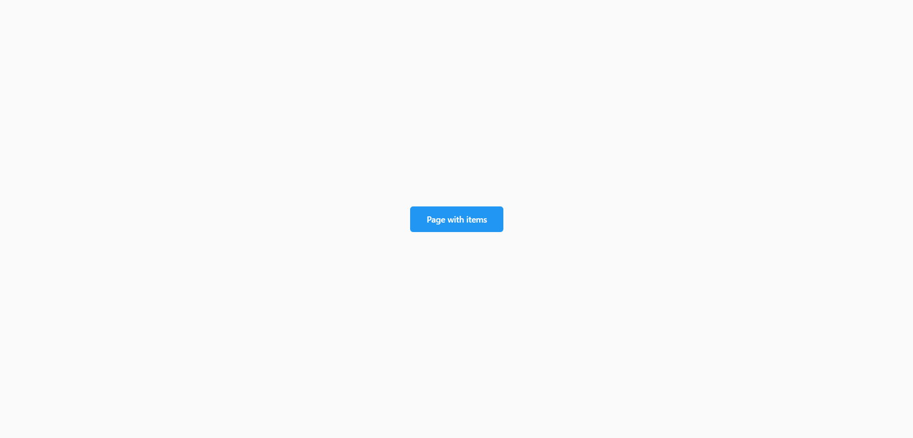
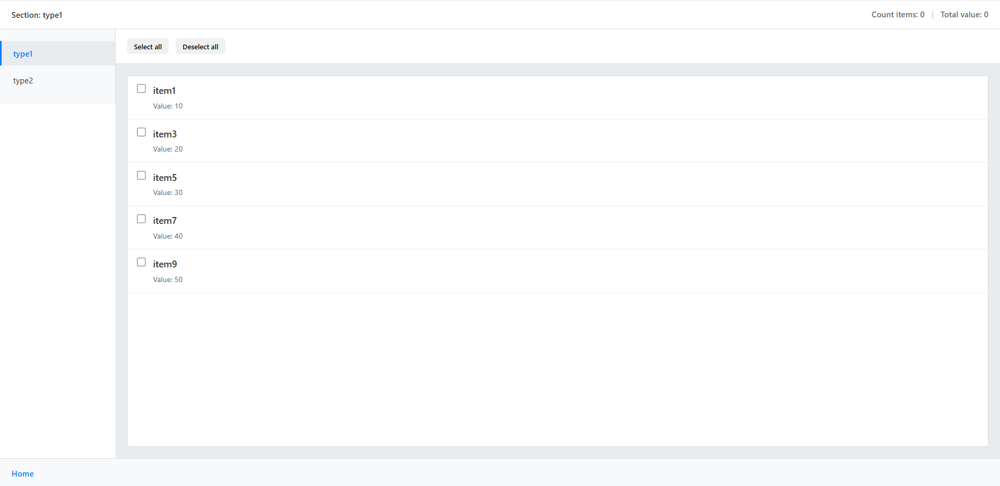
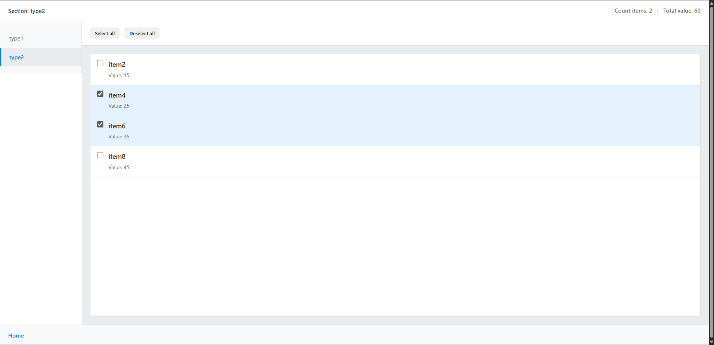

# TestAppForSelectel

An Angular 19+ mini-application that demonstrates working with a reactive state based on Signals and Standalone Components.

## Description

The application consists of two pages:
-**Main page** — a page with a button to go to the second page
-**Second page**- — a list of items with a checkbox, a count of the selected items and their total value

## Technology stack

- **Angular** 19+
- **TypeScript**
- **Standalone Components**
- **Signals**
- **Angular Router**
- **SCSS**

## Installation and startup

### Requirements
- Node.js >= 18.x
- npm >= 9.x

### Installation 
1. **Clone the repository**:
```bash
git clone <repository-url>
cd test-app-for-selectel
```

2. **Install the dependencies**:
```bash
npm install
```

3. **aunch the app**
```bash
ng serve
```

4. **Open a browser and navigate to**
```http://localhost:4200/```


## Functional

### Main page
- **Button "Page with items"**

### Second page

- **Displaying a list of items from a checkbox**
- **Shows the name of the current section**
- **Counts the number of selected items**
- **Calculates the total cost of selected items**
- **Buttons "Select all" / "Deselect all"**
- **Switching between sections (type1, type2)**

## Data

All data is stored statically in the MenuStateService. In a real project, it can be replaced with HTTP requests to the backend.

## Demonstration of the work

### Main page




### Second page




## Author
Sidorov Valentin
